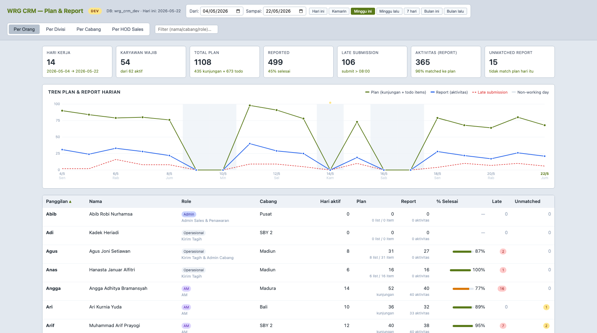
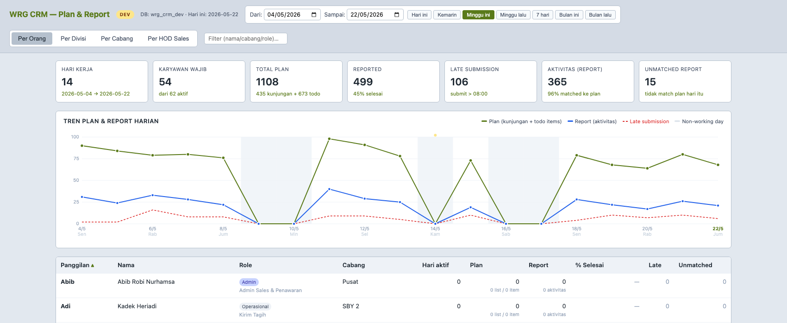
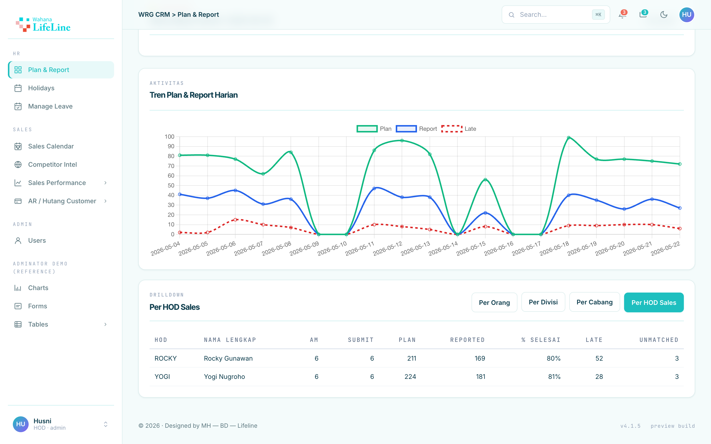
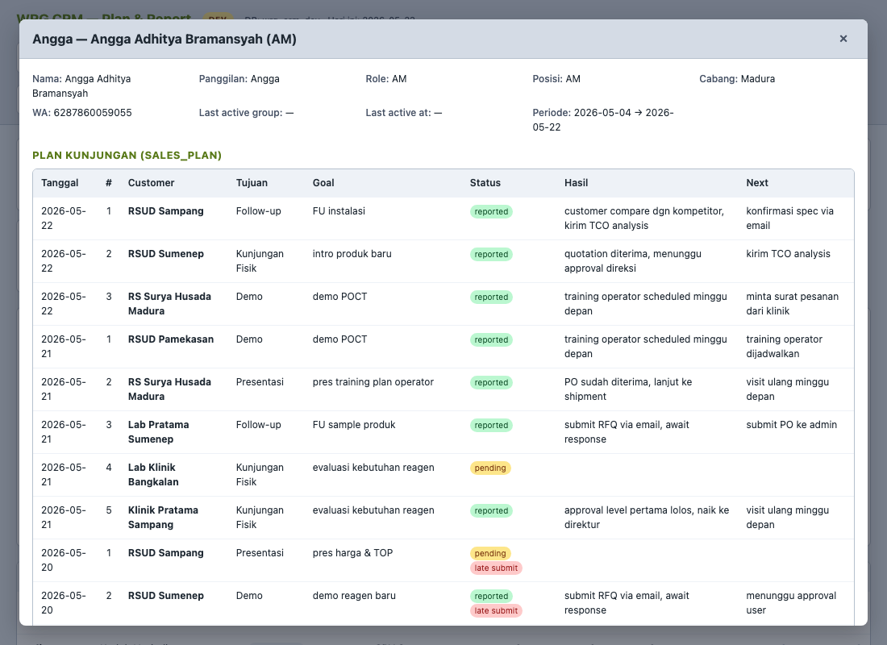

# WRG CRM

WhatsApp-driven CRM untuk tim Wahana Lifeline. Tim submit `#PLAN` & `#REPORT`
via grup WA → bot route ke skill handler → simpan ke PostgreSQL → tampil di
dashboard real-time + PDF report mingguan ke direksi.

> Replaces v4 (Node.js/TypeScript stack). v4 history preserved di branch
> `archive/v4` & tag `v4-archive`.

**Status: 🟢 Prod live sejak 2026-05-24 — batch 1 rollout.**
Bot WA aktif di semua grup yang di-invite. Cron reminder
(`plan_check` / `report_check` / `daily_summary`) target **37 orang** non-AM/
non-Teknisi/non-HOD (Operasional, Admin, Finance, Accounting, Purchasing,
Logistik, Supply Chain, GA). AM (12) & Teknisi (5) **ditunda ke batch 2** —
masih bisa submit kalau mau, tapi gak dapat reminder. Toggle env via
`bash scripts/env-switch.sh dev` kalau perlu revert. Detail batch state:
[`schema/migration_2026-05-24_batch1_rollout.sql`](schema/migration_2026-05-24_batch1_rollout.sql).

**Onboarding tim baru / deploy ke Mac Mini baru?** → baca [`SETUP.md`](SETUP.md).

---

## Screenshots

### Per Orang — view utama



Layout redesign 2026 (sidebar Adminator: HR / SALES / ADMIN). Date-range picker (default minggu berjalan, preset Hari ini / Minggu ini). KPI strip 7 metric (Hari kerja, Karyawan wajib, Total Plan, Reported, Late, Aktivitas, Unmatched), reminder widget "belum report hari ini" (collapsible), tren chart harian, dan tabel per-karyawan (role tag, cabang, plan/report count, % selesai, late, unmatched). Klik baris → halaman drilldown.

### Tren Plan & Report harian



Line chart 3 series: Plan total (kunjungan + todo items, hijau), Report aktivitas (biru), Late submission (merah dashed). Weekend & libur nasional tampak sebagai lembah ke 0 (tidak ada hari kerja). Hover titik → tooltip detail.

### Per HOD Sales (East / West)



Tab agregasi khusus AM: grouping by HOD area via `master_territory` table. Compare performance Rocky (East: Bali/Madura/SBY 2/Kediri/Malang/NTB) vs Yogi (West: Cirebon/Lamongan/Madiun/Palembang/Solo & Yogya/Jember) — jumlah AM, submit, plan, reported, % selesai, late, unmatched per HOD.

### Drilldown per orang



Klik baris di tabel Per Orang → halaman detail (`/drilldown.html?user_id=`). Info user + Plan Kunjungan (`sales_plan`) dengan status `reported` / `pending` / `late submit`, hasil + next action per customer, kolom **Visit Geotag** (verifikasi lokasi foto AM), Todo list (`sales_todo`), dan Unmatched activity.

> Screenshots di-generate dari `wrg_crm_dev` dengan demo data (`python3 scripts/seed_demo_data.py`, periode 4–22 Mei) lalu di-capture via `frontend/scripts/wrg-readme-shots.mjs` (Playwright + Chrome). Nama karyawan asli, tapi plan/report numbers fake.

---

## Arsitektur

```
   WhatsApp grup
        │  (#PLAN / #REPORT / #LEADS / #UPDATE)
        ▼
   openclaw gateway (bot +6285168121906)
        │  message.received event
        ▼
   wrg-inbound.sh   ◀──── cron tiap 1 menit
        │
        ▼
   wrg-router  (skill — claude code agent)
        │
        ├─▶ wrg-plan      → INSERT sales_plan / sales_todo
        ├─▶ wrg-report    → INSERT activity_log (fuzzy match ke plan via pg_trgm)
        ├─▶ wrg-leads     → INSERT pipeline_tracker      [🚧 Phase 0 — belum di-deploy]
        └─▶ wrg-update    → UPDATE pipeline_tracker      [🚧 Phase 0 — belum di-deploy]
                                │
                                ▼
                       PostgreSQL  (wrg_crm_dev | wrg_crm_prod)
                                │
                ┌───────────────┼───────────────┐
                ▼               ▼               ▼
        wrg-daily.sh      dashboard.py    cron_weekly_report.sh
        (cron daily)      (HTTP :8091)    (cron Sen 07:00)
              │                                    │
              ▼                                    ▼
       WA reminder ke              PDF report + ringkasan KPI
       AM yg lupa submit           ke admin via WA
```

> **Status handler (per 2026-06-10):** hanya **#PLAN** & **#REPORT** yang live di
> produksi. **#LEADS** & **#UPDATE** masih stub Phase 0 — `scripts/wrg-inbound.sh`
> membalas "🚧 handler belum di-deploy" dan menandai pesan `DEFERRED`. Tabel
> `pipeline_tracker` / `deal_closed` sudah ada di schema (disiapkan), tapi belum diisi.
> Runtime parser sebenarnya = `scripts/wrg-inbound.sh`; file `skills/*/SKILL.md`
> adalah **spec desain**, bukan kode yang dieksekusi openclaw.

---

## Layout repo

```
wrg-crm/
├── config/
│   └── config.sh                  Konfigurasi global + helper (wa_send, log, call_openrouter)
├── schema/
│   ├── master_data_seed.sql       62 master_user + master_territory (AM → cabang/HOD)
│   ├── schema_update_v2.sql       sales_plan, activity_log + extension pg_trgm
│   └── sales_todo_v1.sql          sales_todo (non-AM todo list format)
├── skills/                        Skill definitions (claude-code agent)
│   ├── wrg-router/                Top-level routing: deteksi hashtag → delegate
│   ├── wrg-plan/                  Parser #PLAN, single & multi mode, normalisasi tujuan
│   ├── wrg-report/                Parser #REPORT, fuzzy match ke sales_plan
│   ├── wrg-leads/                 Parser #LEADS, customer baru ke pipeline
│   ├── wrg-update/                Parser #UPDATE, update status pipeline
│   └── wrg-daily/                 plan_check, report_check, daily_summary cron job logic
└── scripts/
    ├── wrg-inbound.sh             Cron 1m: poll openclaw, dispatch ke skill
    ├── wrg-daily.sh               Cron daily: reminder plan (08:15), report (20:30), summary (22:00)
    ├── dashboard.py               HTTP server :8091 — plan/report dashboard
    ├── reload-dashboard.sh        Sync ke ~/wrg-crm-runtime/ + restart launchd
    ├── seed_demo_data.py          Generate realistic demo data di dev DB
    ├── export_pdf.sh              Headless Chrome --print-to-pdf
    ├── cron_weekly_report.sh      Cron Sen 07:00: PDF mingguan + notif WA admin
    ├── cron_hod_daily_reminder.sh Cron 20:00 weekday: reminder HOD giliran daily update (docs/HOD-DAILY-REMINDER.md)
    ├── env-switch.sh              Toggle dev↔prod (DB + inbound filter)
    └── backup_pg.sh               pg_dump nightly ke backups/
```

---

## Database

Singkat — full detail di `schema/*.sql`.

| Table              | Purpose |
|--------------------|---------|
| `master_user`      | 62 karyawan: AM (12), HOD (8), Operasional/Admin/Teknisi/dll (42) |
| `master_territory` | AM → HOD area (Rocky East / Yogi West) → kota coverage |
| `master_holiday`   | Libur nasional 2026 untuk `is_working_day()` |
| `sales_plan`       | Plan kunjungan AM (cust/tujuan/goal/tanggal) |
| `sales_todo`       | Todo list non-AM (items JSONB) |
| `activity_log`     | Hasil kunjungan (#REPORT) — link ke `sales_plan.id` via `plan_id` |
| `pipeline_tracker` | Customer pipeline (lead → quote → close) |
| `processed_message`| Idempotency: skip pesan yg udah di-process |

Views helper:
- `daily_plan_report_status` — used by `wrg-daily plan_check`
- `daily_plan_status_all` — gabungan AM + non-AM (sales_plan + sales_todo)

---

## Operasi

### Dashboard

```bash
# Manual run (port 8091)
python3 scripts/dashboard.py --port 8091

# Auto-start lewat launchd
launchctl bootstrap gui/$(id -u) ~/Library/LaunchAgents/ai.wrg-crm.dashboard.plist
```

Buka **http://127.0.0.1:8091**. Fitur:
- 4 tab: Per Orang · Per Divisi · Per Cabang · Per HOD Sales
- Date range picker + preset (Hari ini, Minggu ini, Bulan ini, dll)
- Tren chart harian (Plan/Report/Late) dgn weekend & holiday shading
- Drilldown per user (klik baris)
- URL deep-link: `#tab=hod&from=YYYY-MM-DD&to=YYYY-MM-DD&drilldown=<user_id>`
- Env preview: `?env=prod` baca prod DB tanpa flip global env-switch
- PDF export mode: `?export=pdf` (dipakai `export_pdf.sh`)

**Edit workflow**: edit di `scripts/dashboard.py`, lalu `bash scripts/reload-dashboard.sh` — copy ke runtime location + restart launchd job + smoke test endpoint. Workaround untuk macOS Sequoia TCC yg blokir launchd baca Documents folder utk LaunchAgent label baru.

### Environment switch

```bash
bash scripts/env-switch.sh status         # current env + row counts
bash scripts/env-switch.sh dev            # → wrg_crm_dev + Research grup only
bash scripts/env-switch.sh prod           # → wrg_crm_prod + semua grup (minta YES confirm)
```

Single source of truth: `data/state/environment` (gitignored).

### Demo data

```bash
python3 scripts/seed_demo_data.py
```

TRUNCATE sales_plan/sales_todo/activity_log di **dev DB only**, lalu insert
~435 plan + ~175 todo + ~365 activity rows (realistic pattern, 3 minggu kerja).
`random.seed(42)` → reproducible.

### PDF export

```bash
# Default: minggu ini, save ke exports/
bash scripts/export_pdf.sh

# Custom range
bash scripts/export_pdf.sh 2026-05-04 2026-05-22

# Preview prod tanpa flip env
bash scripts/export_pdf.sh --env prod 2026-05-01 2026-05-22
```

Output: `exports/wrg-report-{from}_{to}-{timestamp}.pdf` (~660KB, 7 halaman).

---

## Cron schedule

```
*/1 * * * *   wrg-inbound.sh          → poll WA & dispatch ke skill
15  8 * * *   wrg-daily.sh plan_check  → reminder yg belum kirim plan (batch 1, 15-min nudge before deadline 08:30)
30 20 * * *   wrg-daily.sh report_check → reminder AM yg belum kirim report
0  22 * * 1-5 wrg-daily.sh daily_summary → AI summary ke admin
0  20 * * 1-5 cron_hod_daily_reminder.sh → reminder HOD giliran daily update (genap=Rocky/ganjil=Yogi, deadline 20:30)
*/10 * * * *  detect_leave.sh            → auto-detect izin/sakit/cuti dari grup HRD via LLM + approval
0   2 * * *   backup_pg.sh             → pg_dump nightly
0   7 * * 1   cron_weekly_report.sh    → PDF mingguan + notif WA ke direksi
```

LaunchAgents:
- `ai.wrg-crm.dashboard` — dashboard.py @ :8091 (always-on)

---

## Stack

- **Database**: PostgreSQL 16 (homebrew), extension `pg_trgm` untuk fuzzy match
- **Dashboard**: Python 3 stdlib only (no Flask/FastAPI), psql subprocess untuk DB calls
- **WhatsApp gateway**: openclaw v2026.5.7
- **AI**: OpenRouter (Claude Haiku 4.5 primary, DeepSeek R1 fallback) untuk daily summary
- **Cron**: macOS user crontab
- **Process supervision**: launchd (only untuk dashboard)

---

## Local-only artifacts (gitignored)

```
backups/            pg_dump nightly snapshots
exports/            generated PDFs (regenerable)
logs/               cron + dashboard logs
data/state/         runtime: environment flag, inbound cursor
data/daily-summary/ AI-generated summaries
.claude/            Claude Code per-user permission allowlist
```

`~/Library/LaunchAgents/ai.wrg-crm.dashboard.plist` & `~/wrg-crm-runtime/`
juga lokal — di-bootstrap manual sekali, gak masuk repo.
